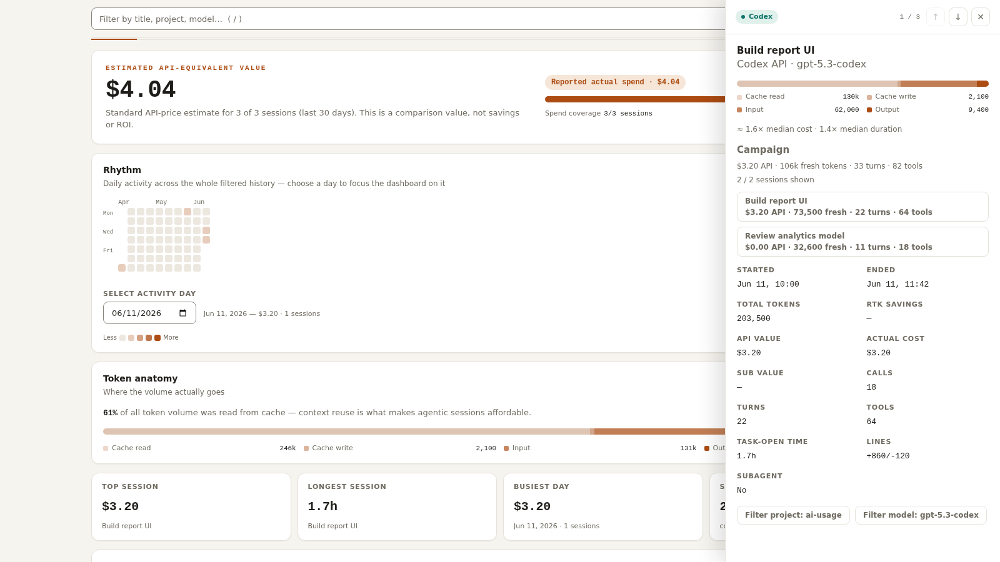

# ai-usage

Local AI coding-tool usage, made explorable.

ai-usage brings Codex, Claude Code, OpenCode, and Cursor sessions into one CLI and interactive Solid dashboard. See activity at a glance, filter and sort the session history, compare harnesses/models/projects, and open detailed chronology without sending normal report data to a hosted analytics service.



## Try the privacy-safe demo

With [Bun](https://bun.sh/) installed:

```sh
bun install
bun run demo
```

The demo binds only to `127.0.0.1` and uses committed deterministic synthetic data. It preserves Overview, filters, session selection, and the full detail drawer while local reads, mutations, business fetch/XHR, source events, and live collector construction stay disabled. The browser test for that boundary lives in [demo-privacy.spec.ts](apps/web/e2e/demo-privacy.spec.ts).

## Frontend engineering highlights

- A server-rendered TanStack Router bootstrap removes the first-load blank state, while exact-revision destination queries prevent mixed live snapshots ([ADR](docs/adr/0007-server-render-report-bootstrap.md)).
- Continuous, windowed scrolling makes all 5,000 synthetic session IDs reachable exactly once on desktop and mobile with bounded requests and DOM size ([measurements](docs/session-scroll-benchmark.md)).
- Compact heatmap and Punchcard visuals retain their density while exposing equivalent keyboard, touch, and semantic-table interactions ([accessibility decision](docs/adr/0005-compact-accessible-visualizations.md)).
- One Playwright stack covers behavior, privacy, production integration, axe, visual snapshots, browser errors, and failed critical requests ([regression decision](docs/adr/0006-one-browser-regression-stack.md)).

Read the [frontend case study](docs/frontend-case-study.md) for the constraints, architecture, performance evidence, testing strategy, and honest trade-offs. Package ownership and private-data boundaries are documented in [architecture](docs/architecture.md).

Normal report collection stays on the local machine. The optional served Codex usage-limit source is the narrow exception: it may invoke the installed `codex app-server`, which owns provider communication and authentication refresh. ai-usage never reads Codex credentials or stores or logs raw app-server payloads.

## Supported session sources

| Harness | Local history |
| --- | --- |
| Claude Code | `~/.claude/projects/**/*.jsonl` (+ `~/.claude.json`) |
| Codex | `~/.codex/sessions/**/*.jsonl` |
| OpenCode | `~/.local/share/opencode/opencode.db` |
| Cursor | `~/Library/Application Support/Cursor/User/globalStorage/state.vscdb` |

Cursor data is partial because some usage counters are stored server-side; those rows are flagged in the report.

### RTK savings (optional)

If RTK (a token-killer CLI proxy) has a local history database at `~/Library/Application Support/rtk/history.db`, sessions are enriched with the token savings RTK achieved. Each RTK command is matched to a session by project path and time window. Savings are persisted as an RTK-owned contribution separate from the collector-owned base row, so later base re-imports, no-match runs, disablement, and restarts preserve the last durable enrichment.

## Requirements

- Bun

Install dependencies:

```sh
bun install
```

## Run

Default report (per-session table + analytics):

```sh
bun run cli
```

Limit the displayed session table:

```sh
bun run cli -- --limit 20
```

Filter by recent activity:

```sh
bun run cli -- --since 30d
```

Filter by harness:

```sh
bun run cli -- --harness codex
```

Show Codex subscription quota (5h / 7d windows) from the newest local rate-limit snapshot:

```sh
bun run cli -- quota
```

The served app runs a Bun-owned control plane even when no browser is open. Its seven independent collection sources are Claude, Codex, OpenCode, and Cursor sessions; Codex usage limits; RTK savings; and Cursor commit attribution. Each source has separate policy, detection, lifecycle, outcome, and cadence state on `/sources`. Sparse policy overrides live only in `~/.config/ai-usage/config.json`; repository config cannot enable background work.

Collectors persist normalized contributions before a separate stored-only publication job creates an immutable report revision. Publication requests use monotonic demand, and timed-out work aborts at the provider boundary before later writes. Disabling, missing input, empty output, or failure never deletes prior contributions. The browser strictly decodes sanitized replacement snapshots plus explicit publication events through one SSE connection. TanStack Query owns ordinary finite Skills and quota reads; the served-report session remains the sole exact-revision owner.

## Multi-machine usage

If you work across multiple machines (e.g. a Mac and a Linux PC), you can merge their usage into one report.

### 1. Export a snapshot on the other machine

```sh
bun run cli -- snapshot --out ~/Desktop/mac-usage.json
```

Transfer the file to this machine (AirDrop, scp, Syncthing, USB...).

The first export creates a stable machine identity in `~/.config/ai-usage/machine.json`. Rename it for friendlier labels:

```sh
bun run cli -- machine                 # show current id + label
bun run cli -- machine set-label "MacBook Pro"
```

### 2. Merge snapshots into a report

```sh
# Merge a copied snapshot with this machine's local history
bun run cli -- merge ./mac-usage.json --local

# All normal report options work on merged data
bun run cli -- merge ./mac-usage.json --local --since 30d --project exalibur --csv
```

Duplicate sessions (same machine, same harness, same session ID) are deduplicated automatically. The newest snapshot wins.

### 3. Import or export stored usage in the web app

The interactive report includes a file-only transfer workspace at `/sync`. Export this machine's stored usage as a JSON merge bundle, copy the file with a tool you trust, then preview the exact insert/update/delete effects and confirm that same digest/store generation on the other machine. Imports are explicit and bounded; the application does not open a LAN listener or synchronize in the background.

Usage snapshots and merge bundles serve different workflows: `snapshot` plus `merge` creates a one-off combined report without changing stored usage, while `/sync` imports a merge bundle into the local usage store for future reports. Both write portable schema version 3. Version-3 files can carry bounded, credential-free session source-control facts; their rows remain portable and cannot authorize local prompt reads or provider lookup. Readers migrate version-1 and version-2 files with source-control context absent.

### 4. See where sessions come from

Merged reports include a `Machine` column (CLI `--wide`, CSV, and dashboard). CSV also includes `machine_id` for scripting.

Projects with the same name from different machines stay separate by default and are displayed with the machine label.
If those folders are intentionally the same project, create a project group in the dashboard's Projects tab.

### 5. Group project folders across machines

The same project often lives at different paths on different machines. Project groups let you merge those sources under one native project name for analytics, filtering, CSV, sessions, and the Projects tab.

Create `~/.config/ai-usage/config.json`:

```json
{
  "projectGroups": [
    {
      "id": "exalibur",
      "name": "exalibur",
      "sources": [
        { "machineId": "macbook-machine-id", "sourcePath": "/Users/nathan/projects/exalibur" },
        { "machineId": "linux-machine-id", "sourcePath": "/home/nathan/projects/exalibur" },
        { "machineId": "macbook-machine-id", "sourcePath": "/Users/nathan/projects/exalibur2" }
      ]
    }
  ]
}
```

Or use the live dashboard:

```sh
bun run dev
```

Then open the Projects tab. The UI shows detected project sources with machine labels and writes project groups to your local config.

Legacy `projectAliases` are still supported as broad report-time groups, but new dashboard edits write `projectGroups`.
Config stays local to your machine and is never read from the repo.

### 6. Discover project sources

See all project folders across machines to decide which ones to alias:

```sh
bun run cli -- projects list --paths ./mac-usage.json --local
```

## Output formats

The default output is a terminal table with an analytics summary. The same report can be emitted in other formats:

JSON:

```sh
bun run cli -- --json
```

CSV:

```sh
bun run cli -- --csv
```

### Interactive report

The web report opens on Overview and lets you:

- switch between **Overview, Sessions, and Breakdown**, with Models, Providers, Harnesses, Projects, and Cursor AI inside Breakdown;
- filter by date range with presets or a custom range, and read the activity timeline;
- analyze local Claude, Codex, and OpenCode chronology from the unified session drawer, using each harness's recorded, partial, or unavailable timing semantics;
- inspect source-dependent repository, branch-span, commit, and recorded pull-request facts when the harness owns them;
- show/hide columns (input/output/cache tokens, RTK savings, durations, turns, tools, line deltas, …), sort, and filter by field;

All exploration state (active view, filters, range, sorting, visible columns) is persisted in the URL, so a report link reopens exactly where you left off.
Detailed prompt bodies are read only on demand from the source machine's local history and may be truncated by safety budgets; that separate prompt collection is not added to report revisions, snapshots, sync payloads, or exports. Normal session names can still come from source-provided or prompt-derived titles and are portable report fields. Claude fallback names are technical identifiers rather than prompt bodies. Provider pull-request lookup is also local and on demand: it runs only after an explicit action, and its result remains ephemeral. Claude's session span is never presented as complete active time because recorded turn durations may cover only part of a session. See [session analysis data sources](docs/session-analysis-sources.md) for the exact guarantees and limitations of each harness.

## Useful options

- `--since <24h|30d|12w>`: only sessions active since the duration
- `--harness <claude|codex|opencode|cursor>`: filter one source
- `--project <name>`: filter by project directory basename (substring match)
- `--min-tokens <n>`: hide tiny sessions (default 1)
- `--limit <n>`: limit only the displayed table; analytics still cover all filtered rows
- `--sort date|tokens|cost`: choose table sort
- `--wide`: add Machine, duration, turns, tool calls, and line delta columns
- `--no-cursor`: skip Cursor
- `--no-color` / `--color`: control ANSI color output (default: auto)
- `--json` / `--csv` / `--payload-json`: pick an output format (mutually exclusive)

`merge` accepts one or more snapshot file paths plus the same report options. Add `--local` to include this machine's local history.

`setup [files...] [--local] [--port <number>]` launches the loopback-only project-grouping UI. Supply at least one snapshot file, `--local`, or both; `--port` changes its local listener port.

Merged CSV/JSON payloads include row provenance (`source.machineLabel`, `source.machineId`, harness key, and source session ID) when available. The terminal table shows `Machine` in `--wide` mode.

## Project layout

- `packages/report-core` (`@ai-usage/report-core`): pure row types, pricing, normalization, analytics, report payloads, and snapshots
- `packages/local-collectors` (`@ai-usage/local-collectors`): Effect-based local history collectors for Claude, Codex, OpenCode, Cursor, RTK enrichment, machine identity, and user config
- `packages/report-data` (`@ai-usage/report-data`): report orchestration seam over core plus local collectors
- `packages/usage-store` (`@ai-usage/usage-store`): SQLite materialization, merge-bundle persistence, and stored report-row queries
- `packages/usage-merge` (`@ai-usage/usage-merge`): explicit merge-bundle file import/export workflows
- `docs/session-analysis-sources.md`: provenance, quality, privacy, and known limitations of per-session analysis for each harness
- `packages/skills` (`@ai-usage/skills`): local skill inventory, validation, projection, and reconciliation workflows
- `packages/design-system` (`@ai-usage/design-system`): Panda/Solid primitives, report style slots, and generated Panda consumer exports
- `apps/cli`: terminal CLI, quota/setup commands, portable snapshots, and table/CSV/JSON/payload output adapters
- `apps/web`: Bun/Nitro source-control host plus the server-rendered Solid/TanStack report, `/sources`, local Skills, and file-only `/sync` workspaces

Architecture docs:

- `docs/architecture.md`: package ownership, data flow, adapter rules, and guardrails
- `docs/frontend-case-study.md`: frontend constraints, decisions, performance evidence, and trade-offs
- `docs/adr/`: short records for the implemented frontend decisions
- `docs/future-work.md`: global backlog for known follow-ups
- `docs/public-package-interfaces.md`: public package exports and import rules
- `docs/generated-tooling-ownership.md`: Panda/TanStack/Nitro/Turbo generated file ownership

## Development

Typecheck:

```sh
bun run typecheck
```

Lint:

```sh
bun run lint
```

Format:

```sh
bun run fix
```

Run unit/integration tests:

```sh
bun run test
```

Run the deterministic browser suites (after `bun x playwright install chromium` once):

```sh
bun run test:e2e
bun run test:e2e-demo
```

After a production build, exercise the loopback production listener and the real
revision/query subprocess path:

```sh
bun run test:web-production
bun run test:setup-loopback
bun run test:e2e-production
```

The ordinary suite includes axe accessibility checks and four focused visual snapshots. The demo suite proves the synthetic runtime makes no business requests. The production suite exercises exact-revision server functions and the 5,000-session scroll proof.

Run the report app in development:

```sh
bun run dev
```

The dev server intentionally reads this machine's configured local data and refreshes the dashboard through immutable, destination-focused report queries. Its bounded support bootstrap reports omitted-item counts when summary metadata does not fit; row-derived destination queries remain independent of those summary omissions. A failed live bootstrap stays in the route's error/retry state. Synthetic data is selected only by explicit demo or E2E modes.

## Notes

- **`$API`** is an estimated cost at standard API prices, computed from local token counters and the editable pricing table in `packages/report-core/src/pricing.ts`. A `≥` value is the known subtotal when only some model segments have pricing; wholly unpriced usage remains unknown.
- **`$Actual`** is out-of-pocket spend when a harness reports it. Subscription products bill differently from per-token API rates, so the two columns can diverge.

## Contributing and license

See [CONTRIBUTING.md](CONTRIBUTING.md) for development and synthetic-fixture guidance and [SECURITY.md](SECURITY.md) for private vulnerability reporting. ai-usage is available under the [MIT License](LICENSE).
